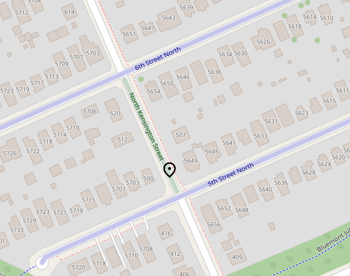

# Translation and localization
Is Perviam not available in your language?, not to worry, Perviam can be translated to any language, and even better,
translations can be commited back to help others save time setting up.

## Creating a translation
To begin with your translation, find the [IETF BCP 47](https://en.wikipedia.org/wiki/IETF_language_tag) language tag
for your target. Prefer [broader tags](https://en.wikipedia.org/wiki/ISO_639-1), like "en" over "en-CA"
whenever possible.

With your target language tag in mind, create a new entry at the Resource Bundle `Messages`,
found at `perviam/src/main/resources`. Example: `perviam/src/main/resources/Messages_fr.properties` for a French
translation, or `perviam/src/main/resources/Messages_fr-CA.properties` for a more specific Canadian French entry.

This file will contain seven lines, each with a single message, formatted as `key=value`. Here are all the messages:

### `placeholder`
This is the placeholder Perviam uses when the target location couldn't be resolved. 
Example: `placeholder=Unknown address`

### `unknown_street`
This is a special placeholder used when a target street with no name is found, but it intersects with other streets that
have enough data to compute a name. In these cases, we need a name to give to this street. 

This value should be set to the most common, generalist name for a "road" in the target language. If two terms are
available, like in road vs street, choose the one that can apply to both urban and rural scenarios.

Example: `unknown_street=Road`

### `address_between_two`
Used when the resolved street address is between two other streets. Take the following location as an example:

The black pin drop represents the target location; the target is located at "North Kensington Street" (green). This street is
located between two other streets, "6th Street North" and "5th Street North" (blue).

Takes three parameters: 

- `{0}` would be the target street ("North Kensington Street") (green)
- `{1}` would be the first street that intersects our current street in the opposite axis from the target street ("6th Street North") (blue)
- `{2}` would be the second street that intersects our current street in the opposite axis from the target street ("5th Street North") (blue)

Example: `address_between_two={0} between {1} and {2}` would produce 
*"North Kensington Street between 6th Street North and 5th Street North"*

### `address_between_one`
Used when the resolved address intersects a single street in the opposite axis.

Takes two parameters:
- `{0}` would be the target street.
- `{1}` would be the intersecting street.

Example: `address_between_one={0} at {1}` would produce *"North Kensington Street at 6th Street North"*.

### `address_lone`
Used when only the current street was found, with no intersections.

Takes one parameter:
- `{0}` would be the target street.

Example: `address_lone={0}` would produce *"North Kensington Street"*.

### `street_ref_prefix`
Used when the found street has no name, but has an associated number. 

The definition for these roads can vary from country to country. In the United States, these are usually a part of the
[United States Numbered Highway System](https://en.wikipedia.org/wiki/United_States_Numbered_Highway_System), ex:
Route 66.

Takes one parameter:
- `{0}` would be the target road.

Example: `street_ref_prefix=Route {0}` would produce *"Route 66"*, when {0} is 66.

### `rural_address`
Rural addresses are a special case in Perviam. They are addresses found outside the boundaries of cities or towns, where
there's usually no real way to reference the position of a vehicle against intersecting streets (because there are none).

Most countries use a "kilometer" or "mile" numeration system to keep track of traversing vehicles, like "Route 66 mile 199".
Although a good solution, this is highly impractical of an implementation for geo-reversing applications, as we would
need to retrieve the entire Route to find the position (and we would need to know where to measure from).

Perviam solves this problem by using the closest landmark, regardless of if heading from, or to it.

Takes three parameters:
- `{0}` would be the target road.
- `{1}` would be the formatted distance to the nearest landmark.
- `{2}` would be the name of the nearest landmark.

- Example: `rural_address={0} at {1} of {2}` would produce *"Route 66 at 102 miles of Amarillo"*

